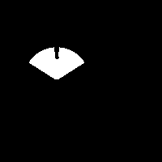
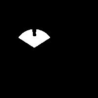
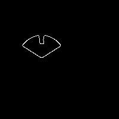
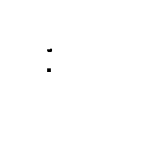
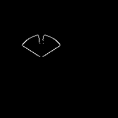
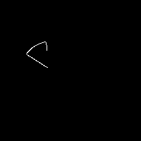
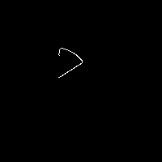
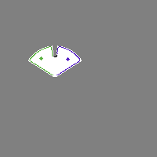
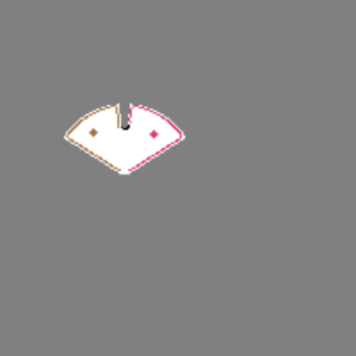

## Frontier detection

### Legend
| Color | Occupancy | Value in grid | Value in img |
| -------- | -------- | -------- | -------- |
| white | Free | 0 | 255 |
| black | Obstacle | 100 | 0 |
| gray | Unknown | -1 | 128 |

--- 

Source 

### Edges

1. Binarization with unknown space as obstacles
2. Erode to avoid get centroid on impassable cell
3. Canny over binary image

### Frontiers

1. Binarization with unknown space as free space
2. Adding drone mask to obstacle map
3. Eroding obstacles

1. Bitwise AND operation between obstacles eroded and edges

 + 
 =

### Segmentation of frontiers

`cv2.findContours()` followed by `cv2.moments()` don't work well for 1 pixel lines (polygons). Using `cv2.connectedComponents()` instead. Three frontiers detected in the example:

Frontiers are filtered by area value in pixels to discard noise or non-relevant frontiers (g.e., see frontiers 2 and 3).

Centroids are calculed with pixel of each frontiers.

